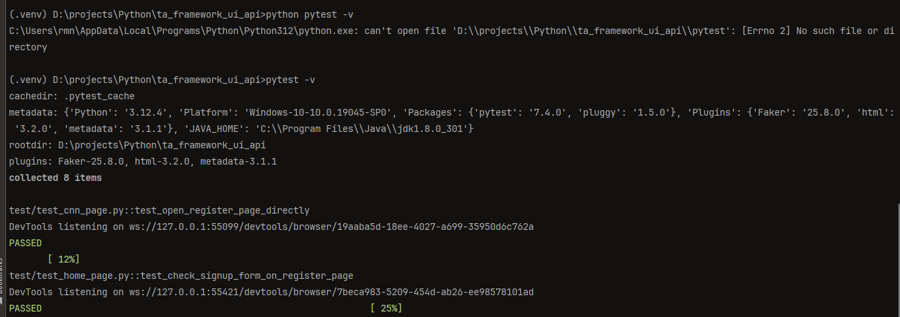

# 'ta_framework_ui_api'

**_Test automation framework for testing UI and back-end (API) restful-booker web app_.**

# Table of contents <div id="toc"></div>

1. [Resources of web app](#resources-of-web-app)
    1. [Restful-booker app resources](#restful-booker-app-resources)
    2. [Restful-booker web app pages](#restful-booker-web-app-pages)
        1. [Booking side](#booking-side)
            1. [Home web page](#home-web-page)
                1. [Basic structure of Home web page](#basic-structure-of-home-web-page)
            2. [Booking web page](#booking-web-page)
        2. [Admin side](#admin-side)
            1. [Admin (Rooms) web page](#admin-rooms-web-page)
            2. [Report web page](#report-web-page)
            3. [Branding web page](#branding-web-page)
            4. [Messages web page](#messages-web-page)
2. [Required Python packages](#required-python-packages)
    1. [For tests itself](#for-tests-itself)
    2. [For web testing](#for-web-testing)
    3. [Utils/Configs](#utilsconfigs)
    4. [Data generators](#data-generators)
    5. [Assertions](#assertions)
3. [Project setup process](#project-setup-process)
    1. [Create and activate a new virtual environment:](#1-create-and-activate-a-new-virtual-environment)
    2. [Install required packages from requirements.txt:](#2-install-required-packages-from-requirementstxt)
    3. [Allure report installation process](#3-allure-report-installation-process)
    4. [Usage DB as source of test data](#4-usage-db-as-source-of-test-data)
        1. [Update DB content](#1-update-db-content)
4. [Tests](#tests)
    1. [Test execution by \_pytest_](#test-execution-by-_pytest_)
        1. [Global test run by command](#global-test-run-by-command)
        2. [Run Single Test - All Tests](#run-single-test---all-tests)
        3. [Run Tests in a Module](#run-tests-in-a-module)
        4. [Test run for specific test (by test name) by command](#test-run-for-specific-test-by-test-name-by-command)
        5. [Run Tests in a directory](#run-tests-in-a-directory)
        6. [Run Tests by Node IDs](#run-tests-by-node-ids)
        7. [Run Tests of a specific class](#run-tests-of-a-specific-class)
        8. [Run Tests by marker expressions](#run-tests-by-marker-expressions)
        9. [Specifying configuration file location](#specifying-configuration-file-location)
        10. [Snippets for running existing tests](#snippets-for-running-existing-tests)
    2. [Test report generation](#test-report-generation)
        1. [By Allure](#by-allure)
            1. [Creating initial pytest reports](#creating-initial-pytest-reports)
            2. [Generating allure reports](#generating-allure-reports)
    3. [Existing(created) test cases by categories](#existingcreated-test-cases-by-categories)
5. [TIPS](#tips)
6. [Another resources for using as pet app for building TA frameworks](#another-resources-for-using-as-pet-app-for-building-ta-frameworks)

## Resources of web app

### Restful-booker app resources

1. [Restful-booker web site URL](https://automationintesting.online/)
2. [Restful-booker API](https://restful-booker.herokuapp.com/apidoc/index.html)

### Booking side

[go to TOC](#table-of-contents)

#### Home web page

<a href="#toc" style="color: green;">go to TOC.</a>

[Home web page: https://automationintesting.online](https://automationintesting.online/)


##### Basic structure of Home web page

    ```
        logo(picture)
            welcome_text
        rooms_section
            room_section
                hotel_picture
                hotel_room_description
                    hotel_room_description_header
                        hotel_room_type
                        hotel_room_wheelchair_option
                    hotel_room_description_title
                    hotel_room_options
                        hotel_room_option_wifi
                        hotel_room_option_refreshments
                        hotel_room_option_tv
                        hotel_room_option_safe
                        hotel_room_option_radio
                        hotel_room_option_views
                    hotel_room_booking_button
                booker_contact_form
                    name_input_form
                    email_input_form
                    phone_input_form
                    subject_input_form
                    message_input_form
                    submit_button_on_contact_form
                    alert_booker_form
                hotel_contact_details_field
                map_picture
                footer_panel
                    site_owner_info
                    cookie_policy_link
                    privacy_policy_link
                    admin_panel_link
    ```

### Booking web page

<a href="#toc" style="color: green;">go to TOC.</a>

[Booking web page: https://automationintesting.online](https://automationintesting.online/)

Same URL as for Home page but with additional components on the page


## Admin side

### Admin (Rooms) web page

<a href="#toc" style="color: green;">go to TOC.</a>

[Home web page: https://automationintesting.online/#/admin/](https://automationintesting.online/#/admin/)


### Report web page

<a href="#toc" style="color: green;">go to TOC.</a>

[Report web page: https://automationintesting.online/#/admin/report](https://automationintesting.online/#/admin/)


### Branding web page

<a href="#toc" style="color: green;">go to TOC.</a>

[Branding web page: https://automationintesting.online/#/admin/branding](https://automationintesting.online/#/admin/)


### Messages web page

<a href="#toc" style="color: green;">go to TOC.</a>

[Messages web web page: https://automationintesting.online/#/admin/messages](https://automationintesting.online/#/admin/messages)


# Test framework configuration and setup

## Required Python packages

<a href="#toc" style="color: green;">go to TOC.</a>

Mandatory Python packages for the current project is available in `requirements.txt`

Below is the list of main packages with references

## For tests itself

<a href="#toc" style="color: green;">go to TOC.</a>

* **pytest**
    * pypi.org docs: https://pypi.org/project/pytest/
    * related info: https://pytest.org/ \
    ```
    pip install pytest
    ```
  
* **hypothesis**
    * pypi.org docs: https://pypi.org/project/hypothesis/
    * related info: https://pytest.org/ \
    ```
    pip install hypothesis
    ```
  


## For web testing

<a href="#toc" style="color: green;">go to TOC.</a>

* **selenium**
    * pypi.org docs: https://pypi.org/project/selenium/
    * related info: https://selenium-python.readthedocs.io/ \
    ```
    pip install selenium
    ```


* **webdriver-manager**
    * pypi.org docs: https://pypi.org/project/webdriver-manager/
    * related info:https://github.com/bonigarcia/webdrivermanager \
    ```
    pip install webdriver-manager
    ```

## Utils/Configs

<a href="#toc" style="color: green;">go to TOC.</a>

* **mypy**
    * pypi.org docs: https://pypi.org/project/mypy/
    * related info: https://mypy-lang.org/ \
    ```
    pip install mypy
    ```


* **pylint**
    * pypi.org docs: https://pypi.org/project/pylint/
    * related info: https://mypy-lang.org/ \
    ```
    pip install pylint
    ```
    
    Generating config file for pylint by 
    ```
    pylint --generate-rcfile > pylint.rc
    ```

* **python-dotenv**
    * pypi.org docs: https://pypi.org/project/dotenv/
    * related info: https://www.dotenv.org/docs/languages/python \
    ```
    pip install python-dotenv
    ```
  
* **pyyaml**
    * pypi.org docs: https://pypi.org/project/PyYAML/
    * related info: https://pyyaml.org/ \
    ```
    pip install pyyaml
    ```
  
* **configParser**
    * pypi.org docs: https://pypi.org/project/configparser/
    * related info: https://docs.python.org/3/library/configparser.html \
    ```
    pip install configparser
    ```
  
* **openpyxl**
    * pypi.org docs: https://pypi.org/project/openpyxl/
    * related info: https://openpyxl.readthedocs.io/en/stable/ \
    ```
    pip install openpyxl
    ```
    
* **pipdeptree**
    * pypi.org docs: https://pypi.org/project/pipdeptree/
    * related info: https://github.com/tox-dev/pipdeptree \
    ```
    pip install pipdeptree
    ```
  

  
## Logging/Reporting

* **allure**
    * pypi.org docs: https://pypi.org/project/openpyxl/
    * related info: https://openpyxl.readthedocs.io/en/stable/ \
    ```
    pip install openpyxl
    ```

* **pytest-html**
    * pypi.org docs:https://pypi.org/project/pytest-html/
    * related info: https://pytest-html.readthedocs.io/en/latest/ \
    ```
    pip install pytest-html
    ```

* **loguru**
    * pypi.org docs: https://pypi.org/project/loguru/
    * related info: https://loguru.readthedocs.io/ \
    ```
    pip install loguru

## Data generators

<a href="#toc" style="color: green;">go to TOC.</a>

* **wonderwords**
    * pypi.org docs: https://pypi.org/project/wonderwords/
    * related info: https://loguru.readthedocs.io/ \
    ```
    pip install wonderwords
    ```

* **Faker**
    * pypi.org docs: https://pypi.org/project/Faker/
    * related info: http://faker.rtfd.org/ \
    ```
    pip install Faker
    ```

## DB
* **mysql-connector-python**
    * pypi.org docs: https://pypi.org/project/mysql-connector-python/
    * related info: https://dev.mysql.com/doc/connector-python/en/
    ```
    pip install mysql-connector-python
    ```


## Assertions

<a href="#toc" style="color: green;">go to TOC.</a>

* **PyHamcrest**
    * pypi.org docs: https://pypi.org/project/PyHamcrest/
    * related info: https://pyhamcrest.readthedocs.io/ \
    ```
    pip install PyHamcrest
    ```

* **regex**
    * pypi.org docs: https://pypi.org/project/PyHamcrest/
    * related info: https://wonderwords.readthedocs.io/ \
    ```
    pip install regex
    ```

## Project setup process

<a href="#toc" style="color: green;">go to TOC.</a>

### 1. Create and activate a new virtual environment:

<a href="#toc" style="color: green;">go to TOC.</a>

- **_Create virtual environment._**\
  Script below is creating environment with name 'env'.\
  If you want to create environment with unique name, please replace the env name using your env name in script\
  _python -m {here_is_your_venv_name} ../env_

  Working script for creating venv with name 'venv' is below:
    ```
    python -m venv ../env
    ```
  
  then activate it
    ```
    source ../venv/bin/activate
    ```

    If you like to have different name for the environment
    ```
    python -m venv {venv_for_project}   
    ```

    and then
    
    ```
    source {venv_for_project}/Scripts/activate
    ```

**_For deactivating created env use command_**\
    ```
    deactivate
    ```


### 2. Install required packages from requirements.txt:

<a href="#toc" style="color: green;">go to TOC.</a>

```
pip install -r requirements.txt
```

If **_requirements.txt_** file is missing request, or you have different configuration of the project after
installation, please generate new  _requirements.txt_ file using command\

`
pip freeze > requirements.txt
`

and add it into the root folder of the project.

In case if you are using 'pip-tools' and 
do next steps
1. compile requirements.txt by

`
pip-compile requirements.in
`

2. install dependencies by

`
pip install -r requirements.txt  
`

### 3. Allure report installation process

<a href="#toc" style="color: green;">go to TOC.</a>

1. Check your system on installed and available :
   * JAVA
     ```
     java -version
     ```

   * Node.js
     ```
     node -v
     ```

     If programs are missing install them using info below

2. Install Java 3
    * Download Java 3 [HERE](https://nodejs.org/en/download/package-manager)

3. Install Node.js
    * Download Node.js [HERE](https://nodejs.org/en/download/package-manager)

4. In command prompt, run the below command\
    ```
    npm install -g allure-commandline

5. Add _npm_ and _allure-commandline_ to system path\
    ```
    %AppData\Roaming\npm
    ```
    %AppData\Roaming\npm\node_modules\allure-commandline\bin
   
6. Check that system can have access to allure by\
    ```
    allure --version
    ```

7. Install allure-pytest\
    ``` 
   pip install allure-pytest
    ```
   or from your IDE

### 4. Usage DB as source of test data

<a href="#toc" style="color: green;">go to TOC.</a>

In case if your test data is stored in DB or external files, check the project configuration and adjust test data
manually.

#### 1. Update DB content

<a href="#toc" style="color: green;">go to TOC.</a>

If you are using data from DB generate data based on your testing model or paste it manually
preferable to use pip install mysql-connector-python
 

# Tests

<a href="#toc" style="color: green;">go to TOC.</a>

More information about test runs by pytest you can
find [here](https://pytest-with-eric.com/introduction/pytest-run-single-test/)

## Test execution by _pytest_

<a href="#toc" style="color: green;">go to TOC.</a>

All tests are located in **_tests_** folder

### Global test run by command

<a href="#toc" style="color: green;">go to TOC.</a> /

```
python manage.py test
```
#### Run Single Test - All Tests

<a href="#toc" style="color: green;">go to TOC.</a>

To run all the tests from the root directory, you can use the following command:
```    
python pytest
```

You can add the -v flag to get more verbose output:

``` 
python pytest -v
```



You can enable live console logging using the pytest -s command too.

### Run Tests in a Module

<a href="#toc" style="color: green;">go to TOC.</a>

To run all tests in a specific file (module), use the following command:

`pytest tests/unit/test_functions.py`

#### Test run for specific test (by test name) by command

<a href="#toc" style="color: green;">go to TOC.</a>

Use the `-k` option followed by the name of the test function or method you want to run\
`python -k {some_test}}`\
e.g.\

```
python -k test_dummy_test.py
```

#### Run Tests in a directory

<a href="#toc" style="color: green;">go to TOC.</a>

Perhaps you may decide to split your tests by unit, integration, end-to-end, performance, regression and so on.\
If you need an overview of the various types of testing for your Python applications, this article on the types of
software testing is a good introduction.\
In these cases it’s helpful to run tests within a specific directory, and you can use:\

```
pytest {path_to_the_folder_with_test}
```

e.g.

```
pytest tests/dummy_tests
```

### Run Tests by Node IDs

<a href="#toc" style="color: green;">go to TOC.</a>

To run a specific test, you can use the test’s node ID, which is essentially its path in the syntax:\
{filename.py}::{test_function_name}.\
For example, to run the test_add_negative_numbers function in the test_functions.py file, you can use the following
command:\

```
pytest  test/dummy_tests/test_functions.py::test_add_positive_numbers
```

This runs the **_test_add_positive_numbers_** test in the test_functions.py file.

#### Run Tests of a specific class

<a href="#toc" style="color: green;">go to TOC.</a>

You can also run all tests in a specific class. To do this, you use the :: operator followed by the class name.\
For example, to run all tests in the RegressionTests class, you can use the following command:

`pytest test/dummy_tests/test_functions.py::TestsUnit`

#### Run Tests by marker expressions

<a href="#toc" style="color: green;">go to TOC.</a>

By using markers, you can run specific groups of tests, exclude tests, and prioritize tests. This can help you to write
better tests and to get more value from your test suite.

We’ve covered several kinds of markers in the articles on Pytest Timeout, Pytest Skip Tests and Pytes Asyncio.

In Pytest, you can assign markers to your test functions using the @pytest.mark decorator. You can then use these
markers to run specific tests.

This is especially useful when you have different types of tests, such as fast and slow tests, and you want to run them
selectively.

To run tests based on marker expressions, you use the -m flag followed by the marker name.

```
[pytest]
markers =
    unit : unit tests
    end_to_end  : end to end tests
    skip : slow tests`
```
command is 

```
pytest -m unit
```

In case if ini file located not in the root directory marker should be passed via flag `-c` and valid configured path to
the ini file

#### Specifying configuration file location

<a href="#toc" style="color: green;">go to TOC.</a>

The -c option allows you to specify the path to your pytest.ini file directly.

`pytest -c path/to/your/pytest.ini`\
example of usage for current project is\
`pytest -c config/pytest.ini -m unit`

Better to set the PYTEST_ADDOPTS environment variable to include the config file path:

`export PYTEST_ADDOPTS="-c config/pytest.ini"`

##### Rerun failed tests

```shell
pytest -n 4 --reruns 3 --alluredir="resources/allure_reports
```
_Full Command Breakdown_

-n 4: Runs tests in parallel using 4 worker processes.

--reruns 3: Reruns any failed tests up to 3 times.

--alluredir="resources/allure_reports": Specifies the directory to store Allure reports.

Installing Required Plugins
Make sure you have the required plugins installed:
* for parallel test execution
```shell
pytest-xdist 
```
* for rerunning failed tests
```shell
pytest-rerunfailures 
```
* for Allure report generation
```shell
allure-pytest
```

#### Snippets for running existing tests

<a href="#toc" style="color: green;">go to TOC.</a>

1. Test for checking home page (not a booking view)

```
pytest test/web_app_tests/test_login_page.py::test_check_main_section_of_home_page
```

## Test report generation

<a href="#toc" style="color: green;">go to TOC.</a>

### By Allure

<a href="#toc" style="color: green;">go to TOC.</a>

* Check that the system statisfy Allure requirements
* Confirm that all components installed, report folder is created

### Creating initial pytest reports

<a href="#toc" style="color: green;">go to TOC.</a>

For creating allure reports on the tests performed, you must first run\

```
pytest --alluredir="resources/allure_reports"
```

Pytest reports will be automatically stored into the defined folder after script execution.

### Generating allure reports

<a href="#toc" style="color: green;">go to TOC.</a>

Generating of allure reports is starting after executing\
```
allure serve {path_to_report_folder}
```

Example of command execution:\
```
(.venv) PS {project_dir_path} allure serve "resources/allure_reports"
```
command applickable for the current project configuration
```commandline
allure serve ".resources/allure_reports"
```

After successful execution of command allure starts server and provide server URL for checking allure report in the
browser


## Existing(created) test cases by categories
<a href="#toc" style="color: green;">go to TOC.</a>
### Test List
Total tests: 50
#### 1. Miscellaneous
1. [test_skip_valid_calculations](utilities\etc\dummy_tests\test_functions.py)
2. [test_add_positive_numbers](utilities\etc\dummy_tests\test_functions.py)
4. [test_add_negative_numbers](utilities\etc\dummy_tests\test_functions.py)
8. [test_add_numbers_zero](utilities\etc\dummy_tests\test_functions.py)
16. [TestApiPerformance](utilities\tests\api_tests\other\test_api_performance.py)

#### 2. TestsUnit
1. [test_multiply_numbers](utilities\etc\dummy_tests\test_functions.py)
2. [test_multiply_numbers_zero](utilities\etc\dummy_tests\test_functions.py)

#### 3. TestBackApiAuth
1. [test_back_api_creation_token_by_valid_creds](utilities\tests\api_tests\business_core\test_back_api_auth.py)
2. [test_back_api_creation_token_by_invalid_creds](utilities\tests\api_tests\business_core\test_back_api_auth.py)
4. [test_back_api_creation_token_by_valid_user_creds_and_no_headers](utilities\tests\api_tests\business_core\test_back_api_auth.py)
8. [test_back_api_creation_token_by_no_user_creds_and_valid_headers](utilities\tests\api_tests\business_core\test_back_api_auth.py)
16. [test_back_api_creation_token_by_empty_user_creds_and_no_headers](utilities\tests\api_tests\business_core\test_back_api_auth.py)
32. [test_back_api_creation_token_by_valid_user_creds_and_wrong_type_of_headers](utilities\tests\api_tests\business_core\test_back_api_auth.py)
64. [test_back_api_creation_token_by_invalid_creds_hypothesis_check](utilities\tests\api_tests\business_core\test_back_api_auth.py)

#### 4. TestBackApiBooking
1. [test_backend_api_booking_Existing_bookingID_list_is_not_None](utilities\tests\api_tests\business_core\test_back_api_booking.py)
2. [test_backend_api_booking_Existing_bookingID_list_has_bookingig_greater_0](utilities\tests\api_tests\business_core\test_back_api_booking.py)
4. [test_backend_api_booking_post_call_response_code_check\[backend_api_booking_valid_payload_test_data0\]](utilities\tests\api_tests\business_core\test_back_api_booking.py)
8. [test_back_end_api_create_booking_with_no_token](utilities\tests\api_tests\business_core\test_back_api_booking.py)
16. [test_backend_api_booking_bookingid_notNone_check](utilities\tests\api_tests\business_core\test_back_api_booking.py)
32. [test_backend_api_booking_create_booking](utilities\tests\api_tests\business_core\test_back_api_booking.py)
64. [test_backend_api_booking_update](utilities\tests\api_tests\business_core\test_back_api_booking.py)
128. [test_backend_api_booking_patch_response_is_edited_ok](utilities\tests\api_tests\business_core\test_back_api_booking.py)
256. [test_backend_api_booking_delete_booking_by_valid_id](utilities\tests\api_tests\business_core\test_back_api_booking.py)

#### 5. TestFrontApiAuth
1. [test_front_api_creation_token_by_valid_creds](utilities\tests\api_tests\business_core\test_front_api_auth.py)
2. [test_front_api_creation_token_by_invalid_creds](utilities\tests\api_tests\business_core\test_front_api_auth.py)
4. [test_front_api_creation_token_by_invalid_creds_hypothesis_check](utilities\tests\api_tests\business_core\test_front_api_auth.py)

#### 6. TestFrontApiBooking
1. [test_front_api_create_token](utilities\tests\api_tests\business_core\test_front_api_booking.py)
2. [test_front_api_create_booking_with_valid_token](utilities\tests\api_tests\business_core\test_front_api_booking.py)

#### 7. TestJsonValidation
1. [test_backend_api_Сreate_booking_response_check_via_json_validation](utilities\tests\api_tests\other\test_api_json_shcema_validation.py)
2. [test_backend_api_Existing_booking_by_id_response_check_via_json_validation](utilities\tests\api_tests\other\test_api_json_shcema_validation.py)

#### 8. TestLoginActionFlow
1. [test_login_form_placeholder_text_validation\[setup_and_teardown0\]](utilities\tests\web_app_tests\test_login_page\test_login_actions_validation.py)
2. [test_login_by_valid_admin_creds_by_shared_data_from_excel_by_data_from_fixture\[login_test_data-login_test_data-setup_and_teardown0\]](utilities\tests\web_app_tests\test_login_page\test_login_actions_validation.py)
4. [test_login_by_valid_admin_creds_by_constants\[setup_and_teardown0\]](utilities\tests\web_app_tests\test_login_page\test_login_actions_validation.py)
8. [test_login_by_valid_admin_creds_by_shared_data_from_excel\[admin-password-setup_and_teardown0\]](utilities\tests\web_app_tests\test_login_page\test_login_actions_validation.py)
16. [test_branding_name_validation_by_shared_data_from_excel_with_path\[B\&B](utilities\tests\web_app_tests\test_login_page\test_login_actions_validation.py)
32. [test_branding_name_validation_by_shared_data_from_excel_cell\[data_validation_admin_page_ui-3-5-setup_and_teardown0\]](utilities\tests\web_app_tests\test_login_page\test_login_actions_validation.py)
64. [test_branding_name_validation_by_shared_data_from_excel_for_specific_cases\[data_validation_admin_page_ui-3-5-login_fixture0-setup_and_teardown0\]](utilities\tests\web_app_tests\test_login_page\test_login_actions_validation.py)
128. [test_admin_page_content_validation_by_shared_data_from_db\[setup_and_teardown0\]](utilities\tests\web_app_tests\test_login_page\test_login_actions_validation.py)
256. [test_login_by_single_set_of_invalid_admin_creds\[login_test_by_invalid_data_for_single-setup_and_teardown0\]](utilities\tests\web_app_tests\test_login_page\test_login_actions_validation.py)
512. [test_login_by_multiple_sets_of_invalid_admin_creds\[login_test_by_invalid_data_for_all-setup_and_teardown0\]](utilities\tests\web_app_tests\test_login_page\test_login_actions_validation.py)
1024. [test_admin_login_by_valid_creds\[admin-password-setup_and_teardown0\]](utilities\tests\web_app_tests\test_login_page\test_login_actions_validation.py)

#### 9. TestLoginPage
1. [test_login_by_valid_admin_creds_by_shared_data_from_excel_by_data_from_fixture\[login_test_data-login_test_data-setup_and_teardown0\]](utilities\tests\web_app_tests\test_login_page\test_login_page.py)
2. [test_branding_name_validation_by_shared_data_from_excel_with_path\[setup_and_teardown0\]](utilities\tests\web_app_tests\test_login_page\test_login_page.py)
4. [test_branding_name_validation_by_shared_data_from_excel_cell\[data_validation_admin_page_ui-3-5-setup_and_teardown0\]](utilities\tests\web_app_tests\test_login_page\test_login_page.py)
8. [test_branding_name_validation_by_shared_data_from_excel_for_specific_cases\[data_validation_admin_page_ui-3-5-login_fixture0-setup_and_teardown0\]](utilities\tests\web_app_tests\test_login_page\test_login_page.py)
16. [test_admin_page_content_validation_by_shared_data_from_db\[setup_and_teardown0\]](utilities\tests\web_app_tests\test_login_page\test_login_page.py)

#### 10. TestHomePage
1. [test_check_home_page_footer_presence\[setup_and_teardown0\]](utilities\tests\web_app_tests\tests_home_page\test_home_page.py)
2. [test_check_home_page_footer_content_old\[setup_and_teardown0\]](utilities\tests\web_app_tests\tests_home_page\test_home_page.py)
4. [test_check_home_page_footer_content_new\[setup_and_teardown0\]](utilities\tests\web_app_tests\tests_home_page\test_home_page.py)
8. [test_booking_request_valid_check\[setup_and_teardown0\]](utilities\tests\web_app_tests\tests_home_page\test_home_page.py)


# TIPS

<a href="#toc" style="color: green;">go to TOC.</a>

1. Article: [Python Requirements.txt – How to Create and Pip Install Requirements.txt in Python3.](https://www.freecodecamp.org/news/python-requirementstxt-explained/)


2. Single command for generating requirements.txt
   ```   
   pip freeze > requirements.txt
   ```   


3. Step-by-Step Guide to Creating Python Virtual Environments ()
    * Step 1: verify python installation/
    ```
    python –version
    ```
    * Step 2: install virtualenv\
    ```   
   pip install virtualenv
    ```   
          
    * Step 3: create a new virtual environment\
    ```   
   python -m virtualenv .venv    
    ``` 
   * Step 4: activate the virtual environment
   
       For _Windows_ (Command Prompt or PowerShell):
       ```
       .venv\Scripts\activate
       ```
       For _Unix/Linux_ (Bash/Zsh):
       ```
       source venv/bin/activate
       ```

# Another resources for using as pet app for building TA frameworks

<a href="#toc" style="color: green;">go to TOC.</a>

- [Contact List App - web app for pure API testing](https://thinking-tester-contact-list.herokuapp.com/)
    - was available at 18 June 2024
- Web apps fofr testing
  - [OrangeHRM web app](https://opensource-demo.orangehrmlive.com/)
  - [httpbin.org - web app](https://httpbin.org/#/)
      - was available at 18 June 2024
      - the developer - [Website](https://kennethreitz.org/)
      - A simple HTTP Request & Response Service.
      - Run locally: `$ docker run -p 80:80 kennethreitz/httpbin`
      - [HTML form](https://httpbin.org/forms/post) that posts to `/post /forms/post`
      - was available at 18 June 2024
  - [tutorialsninja.com - web app](https://tutorialsninja.com/demo/)
      - was available at 18 June 2024  
