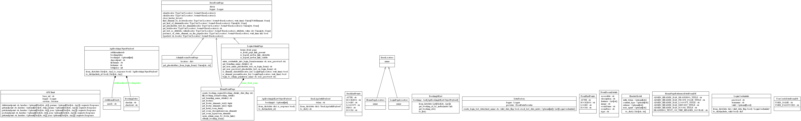
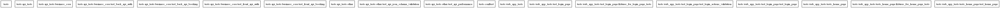

Dependency diagrams
=====================

.. image:: ../_static/images/facepalm.jpg
  :width: 300
  :height: 200

.. _toc:
**Table of Contents**

.. contents::
   :depth: 5
   :local:

core package
------------

Classes
~~~~~~~

Packages
~~~~~~~~~

.. image:: ../_static/diagrams/pics/packages_core.png

core.api.api_client
^^^^^^^^^^^^^^^^^^^^

Classes

.. image:: ../_static/diagrams/pics/classes_core_api_api_client.png

core.api.api_client diagram should be here...

.. inheritance-diagram:: core.api.api_client
   :parts: 1

.. include:: api_client_function_relationships.rst

--------------------------------------

core.pages
~~~~~~~~~~

Classes

.. image:: ../_static/diagrams/pics/classes_core_pages.png

Packages

.. image:: ../_static/diagrams/pics/packages_core_pages.png

  core.pages diagram should be here...

.. inheritance-diagram:: core.pages

--------------------------------------

core.pages.admin_rooms_page
^^^^^^^^^^^^^^^^^^^^^^^^^^^^

  core.pages.admin_rooms_page diagram should be here...

.. inheritance-diagram:: core.pages.admin_rooms_page

--------------------------------------

core.pages.home_page
^^^^^^^^^^^^^^^^^^^^^

    core.pages.home_page diagram should be here...

.. inheritance-diagram:: core.pages.home_page

--------------------------------------

core.pages.login_page
^^^^^^^^^^^^^^^^^^^^^^^^

  core.pages.login_page diagram should be here...

.. inheritance-diagram:: core.pages.login_page

-------------------------------------

core.data
__________

Classes

.. image:: ../_static/diagrams/pics/classes_core_data.png

Packages

.. image:: ../_static/diagrams/pics/classes_core_data.png

core.data.data_models.front_api_booking_object_data_model
~~~~~~~~~~~~~~~~~~~~~~~~~~~~~~~~~~~~~~~~~~~~~~~~~~~~~~~~~~~~~

.. inheritance-diagram:: core.data.data_models.front_api_booking_object_data_model

--------------------------------------

tests
-----

Classes

.. image:: ../_static/diagrams/pics/classes_tests.png

Packages

  tests diagram should be here...

.. inheritance-diagram:: tests

tests_api_tests
~~~~~~~~~~~~~~~

Classes

.. image:: ../_static/diagrams/pics/classes_tests_api_tests.png

Packages

.. image:: ../_static/diagrams/pics/packages_tests_api_tests.png

--------------------------------------

utilities
---------

utilities diagram should be here...

.. inheritance-diagram:: utilities

--------------------------------------

resources
---------

resources diagram should be here...

.. inheritance-diagram:: resources