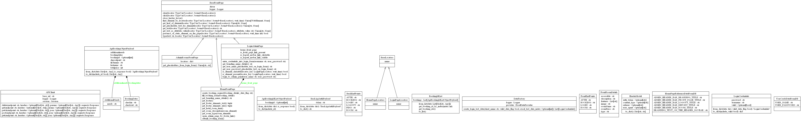
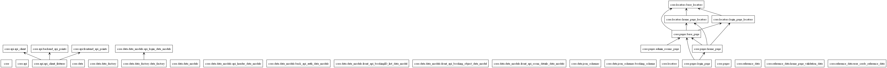
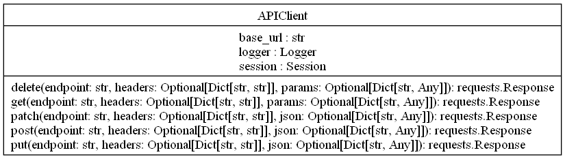
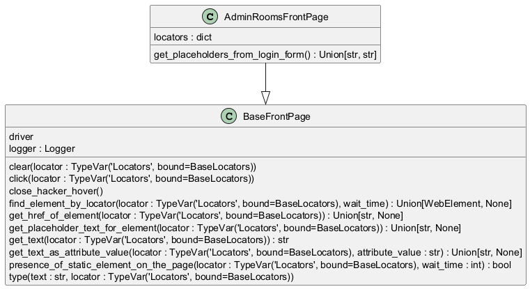
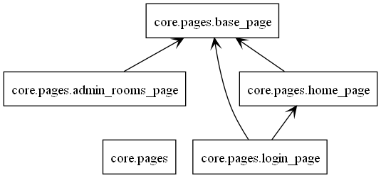
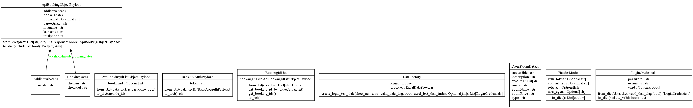

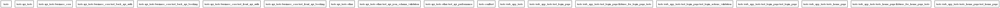
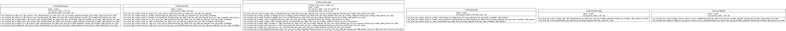
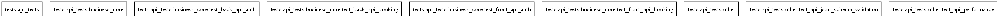

Dependency diagrams
=====================

.. contents::
   :depth: 5
   :local:

core package
------------

Classes

Packages

core.api.api_client
~~~~~~~~~~~~~~~~~~~~

Classes

.. inheritance-diagram:: core.api.api_client
   :parts: 1

See :doc:`api_client_relationships` for the detailed API client graph.

--------------------------------------

core.pages
~~~~~~~~~~

Classes

Packages

--------------------------------------

core.pages.admin_rooms_page
^^^^^^^^^^^^^^^^^^^^^^^^^^^^

.. inheritance-diagram:: core.pages.admin_rooms_page

--------------------------------------

core.pages.home_page
^^^^^^^^^^^^^^^^^^^^^

.. inheritance-diagram:: core.pages.home_page

--------------------------------------

core.pages.login_page
^^^^^^^^^^^^^^^^^^^^^^^

.. inheritance-diagram:: core.pages.login_page

-------------------------------------

core.data
---------

Classes

Packages

core.data.data_models.front_api_booking_object_data_model
~~~~~~~~~~~~~~~~~~~~~~~~~~~~~~~~~~~~~~~~~~~~~~~~~~~~~~~~~~

--------------------------------------

tests
-----

Classes

Packages

tests_api_tests
~~~~~~~~~~~~~~~

Classes

Packages

--------------------------------------

utilities
---------

No class inheritance diagram for this package.

--------------------------------------

resources
---------

No class inheritance diagram for this package.
